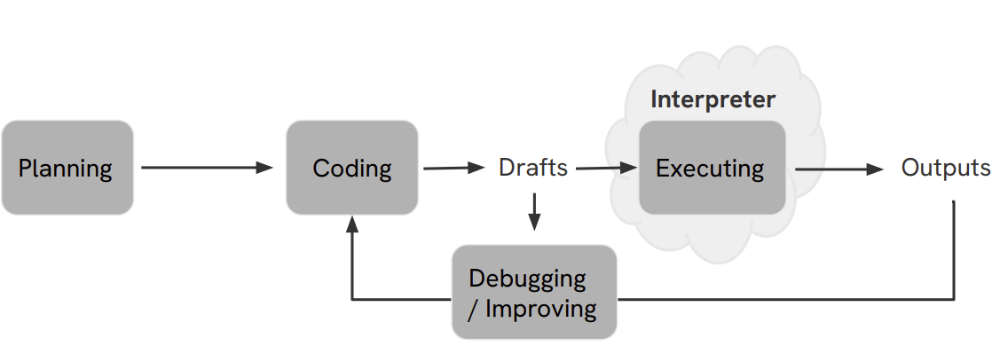

# AI Coding Agent with LLM (AutoML Code Generation Pipeline)

This project is an LLM Agent Coding Framework for solving machine learning tasks automatically. The agent leverages a Large Language Model (LLM), Qwen2.5-14B-Instruct, to plan, code, debug, and improve machine learning solutions in an iterative way, just like a human developer. The entire workflow is implemented in Python and runs on Colab.

#### Core concepts:

- The LLM agent acts as a developer: it receives the task, reviews data, drafts a code solution, executes it, and—based on feedback—can either debug or improve the solution, generating new code as needed.

- Every solution attempt is stored as a Node; all attempts form a tree (Journal), recording the evolution from first draft through improvements/fixes.

- Each iteration (step) is: Plan → Code → Execute → Feedback → (Debug or Improve or Next Draft)

## Code Structure
- **Planning**: The agent reviews the task and data, then proposes a solution plan.

- **Coding**: The LLM writes code according to the plan.

- **Executing**: The code is run by a built-in Python interpreter. Results (outputs, errors, metrics) are captured.

- **Feedback (Debugging/Improving)**:

  - If the code fails or has issues, the LLM debugs and revises the code.

  - If the code is correct but could be better (accuracy/speed), the LLM improves it.

- **Node & Tree Structure**:

    - Each code version (with its plan, code, output, and feedback) is a Node.

    - All Nodes are organized as a solution tree (Journal), showing how the solution evolves.

## Workflow Diagram
Below are visualizations of the workflow and action space.

### Main Pipeline

- **Planning → Coding → Executing (Interpreter) → Outputs**

- **Drafts** may loop back for debugging/improvement until a satisfactory solution is found.

### Action

- 1st Draft: code, execution, feedback.

- 2nd Draft: can be from new plan, debugging, or improving the previous draft.

- The agent makes decisions automatically: should it start fresh, debug, or improve?

## Features
- **Data Preview**: The agent summarizes all input CSV files and identifies candidate features for prediction (feature extraction).

- **Prompt Engineering**: Systematically constructs prompts for the LLM to plan, code, debug, and improve.

- **Interpreter**: Securely runs generated code and captures output, exceptions, and metrics.

- **Evaluation**: Uses Mean Squared Error (MSE) as the grading metric for regression.

- **AutoML Loop**: The agent automatically iterates between drafting, debugging, and improving, saving best solutions.

## Example Output
- Each run produces a summary of each step:

    - The agent’s plan, code, execution result, and MSE metric.

    - Example: Step 0: is_buggy=False, metric=0.14...

- Final best code and intermediate "good" solutions are saved as Python files in the output folder.

## How it Works
- All prompts, code, and execution are managed by the agent.

- You can swap in different LLMs by changing the model path.

- The code is modular; each responsibility (planning, coding, execution, evaluation) is encapsulated as a function or class.

- The agent is fully automated—no human in the loop is required once started.

## References
- [Qwen2.5-14B-Instruct model](https://huggingface.co/bartowski/Qwen2.5-14B-Instruct-GGUF/tree/main)
- [HUNG-YI LEE Machine Learning 2025](https://speech.ee.ntu.edu.tw/~hylee/ml/2025-spring.php)